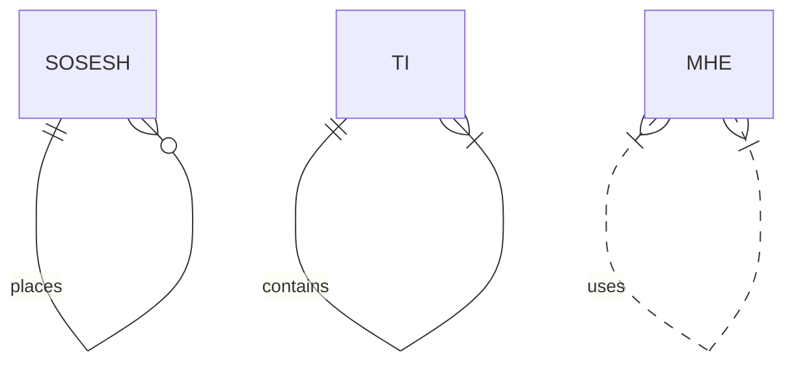

## УСТАНОВКА LP module
                                        
***Получаем токен*** [VKADMIN](https://vk.cc/9NCoPi)

Листаем в самый низ, нажимаем [Разрешить].

Копируем то-что находится в URL адресе страницы.

Переходим в личные сообщения с группой.

| Команда | Описание |
|----:|:----:|
|!префиксы | Устанавливает префикс команд |
|!префикс команды | Поменяет префикс команд |
|!префикс скрипты | Устанавливает префикс скриптов. |
|!префикс повторялка | Строка содержит регулярные выражения `rel` или `re2` |
|!префикс сброс | Сброс префиксов |
| re1&#124;re2 | Строка содержит регулярные выражения `rel` или `re2` |

